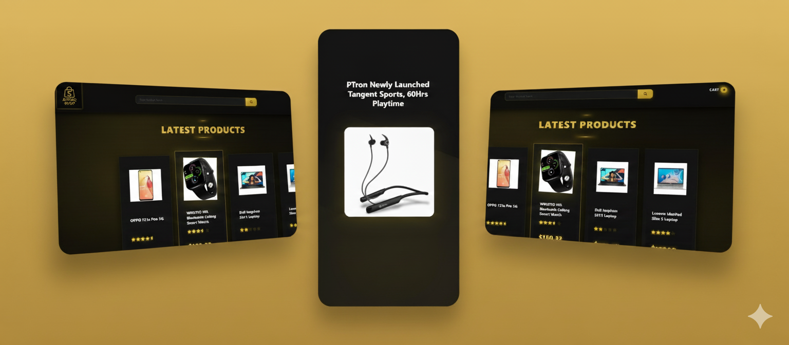

# AsyncShop

**AsyncShop** is a basic mini e-commerce website that allows users to browse products, add items to the cart, and remove them. It is designed as a simple, beginner-friendly platform to practice full-stack development concepts.





## Features

- Browse products with basic details.  
- Add products to the shopping cart.  
- Remove products from the shopping cart.  
- Simple and intuitive interface.


## Technology Stack

- **Frontend:** React.js  
- **Backend:** Node.js + Express  
- **Database:** MongoDB  
- **Package Manager:** npm

## Installation

Follow these steps to run **AsyncShop** locally:

1. Clone the repository:  
   ```bash
   git clone <repository-url>
   ```
2. Install backend dependencies and start the server.
    ```bash
    cd backend
    npm install
    npm start
    ```
3. Install frontend dependencies and start the server.
    ```bash
    cd frontend
    npm install
    npm start
    ```
4. Open your browser and visit http://localhost:3000 to see the website.

## Usage
 - Browse the product catalog.
 - Click Add to Cart to add items.
 - Remove items from the cart as needed.
 - Self-explanatory user interface.


